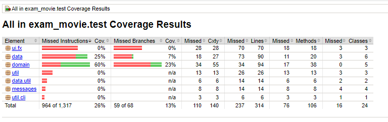

# Final Project: Secure Programming NWMUS 2023

## Table of Contents

- [1. Project Analysis](#1-project-analysis)
  - [1.1 PMD](#11-pmd)
  - [1.2 Coverage](#12-coverage)
    - [1.2.1 IntelliJ](#121-intellij)
    - [1.2.2 JaCoCo](#122-jacoco)
      - [Exclude Class/Methods](#exclude-classmethods)
  - [1.3 Automated Test And GitHub Actions](#13-automated-test-and-github-actions)
  - [1.4 Fighting with Java](#14-fighting-with-java)
- [2. Improvement](#2-improvement)
  - [2.1 Tests](#21-tests)
  - [2.3 Input Validation](#23-input-validation)
  - [2.3 PMD](#23-pmd)
    - [2.3.1 One-line If/Else](#231-one-line-ifelse)
    - [2.3.2 Error Messages](#232-error-messages)
    - [2.3.3 PMD New report](#233-pmd-new-report)
- [3. Review](#3-review)
  - [3.1 Readability ](#31-readability)
  - [3.2 Structure](#32-structure)
  - [3.3 Security](#33-security)
    - [3.3.1 Secure SQL Connection](#331-secure-sql-connection)
    - [3.3.2 USe of prepared statements](#332-use-of-prepared-statements)
    - [3.3.3 Logging](#333-logging)
    - [3.3.4 Input Validation](#334-input-validation)
  - [3.4 Reflection](#34-reflection)
    - [3.4.1 Should be added](#341-should-be-added)

---

# 1. Project Analysis

The project is a project from my home institution. 
From my **Object Oriented Architectures and Secure Development** class, it was the mock exam I did as a preparation for the final exam.

One part of the code was based on a connection with a server. 
As the server used for the project is not running anymore, it's not possible for me to verify if the code is working, and I decided not to implement the different fixes on it.
I have however considered them and will add some reflexion on this part of the code too.

## 1.1 PMD

For project analysis, I employed the [PMD Source Code Analyzer](https://pmd.github.io/).

> pmd.bat check -d "C:\Users\romane\Documents\NW 2023\SP project"  -R rulesets/java/quickstart.xml -f html > C:\Users\romane\Desktop\testPMD.html
> 
> 
Explore the detailed analysis results [here](/Analysis/PMD-Report.html).

## 1.2 Coverage

I will be using both **IntelliJ Building Coverage** and **JaCoCo**. As seen in the following screenshots, the coverage was not perfect but not at 0, which is a positive sign.

### 1.2.1 IntelliJ

Html report can be found [here](/Analysis/Coverage/Intelij).

### 1.2.2 JaCoCo

Html report can be found [here](/Analysis/Coverage/JaCoCo).

I have added a GitHub workflow that creates a JaCoCo report with every push, along with a percentage badge at the beginning of this README. The original badge before adding the tests can be seen .

#### Exclude Class/Methods

To exclude classes and/or methods from the JaCoCo report, I added the `@Generated` annotation, following the instructions in this [Source: Jacoco report exclude](https://www.baeldung.com/jacoco-report-exclude).

---

By putting the two reports next to each other, we can directly observe significant differences in results, especially for the **data**.

---

## 1.3 Automated Test And GitHub Actions

Find my workflow action [here](https://github.com/Rdevezeaux7685/Final-Project/actions/workflows/runtests.yml). 
The actions run automatically with every push.

While the Gradle plugin in IntelliJ works perfectly fine, I encountered issues using `./gradlew` from the terminal. 
his problem was resolved by changing the JAVA version to Java 17.

> Jacoco badge instructions: [jacoco-badge-generator](https://github.com/cicirello/jacoco-badge-generator)

### 1.4 Fighting with Java

Adding `%USERS%.jdks\azul-17.0.9\bin` to my path helped change the Java version, enabling building from the terminal. 
For the GitHub action, updating the YAML file to use Java 17 resolved the issue.

# 2 Improvement

## 2.1 Tests

Basic tests were added to the project using the IntelliJ built-in test generator. 
I added tests for the `domain` classes and the `util/cli` and `util`. 
Although these tests improved project coverage, they do not cover every possible outcome and could be enhanced.

## 2.3 Input Validation

There was _no input validation_.

As there is not much input that can be tested, I have done input validation on the **registration** and **login** of a **user**.

Appropriate error messages where added.

## 2.3 PMD

### 2.3.1 One-line If/Else

Upon reviewing the PMD report, some issues were identified. For instance, PMD considers having an `if` statement on one line without braces as an error.

Initially, I did not agree with this and had to add braces:

Here is the **PMD-approved** version:

### 2.3.2 Error Messages

My `MovieException` class was initially designed to return simple strings, PMD suggested keeping the caught exception and including it in the MovieException.

## 2.3.3 PMD New report

The new report made after improvements can be found [here](Review/pmd-report.txt)

_(The project has been relocated on my computer, resulting in a different file path compared to the previous report. However, the project itself remains the same)_

## 2.4 Coverage

As visible on the badge at the top of the guide. The general coverage was greatly improved.
This is the new Jacoco report after adding test.

A new Jacoco report was added [here](/Review/jacoco)

Some test should be added on the socket. This is mentioned here [3.4 Reflection](#34-reflection)

---

# 3. Review

## 3.1 Readability

The code demonstrates strong readability with consistent naming logic throughout. Function and argument names are appropriate, making the code easily understandable. While lacking comments, this was intentional, as we were asked to write code aimed to be self-explanatory. Overall, navigating and modifying the code was easy and didn't require a lot of time to understand what was happening.

## 3.2 Structure

The project structure, integral to my class, was based on an n-tier architecture:

- **Data Layer:**
  - Handles communication with the data sources (MySQL, and the socket)

- **Domain/Model Layer:**
  - Comprises POJOs representing entities from the data source.

- **Services Layer:**
  - Encompasses non-UI logic, acting as an intermediary between the data layer and UI.

- **User Interface Layer:**
  - Responsible for displaying information on screen.
  - Captures user input for further processing.

The code shows good design, providing excellent functionality for users. UI changes are sensible, maintaining an aesthetically pleasing appearance. Parallel programming is implemented safely, and the code avoids unnecessary complexity or future-proofing.

The services layer facilitates segregation between code/user and data, enhancing security measures.

Though lacking sufficient unit tests initially, additional tests were incorporated during the review.

## 3.3 Security

The following good security/coding practices were implemented:

### 3.3.1 Secure SQL Connection:

  The SQL classes were already covering the security advice provided in class. Usernames/passwords are **encrypted** and not used as plaintext. Encryption files can be found in `/util`, and the configuration file for the database is in `resource/config/config.properties`.
  

### 3.3.2 Use of prepared statements:

  Prepared statements and `stmt.setString` were used to protect the data and prevent potential SQL injections.

  

### 3.3.3 Logging:

  Logging was implemented for the entire project. No additional implementation was needed.

### 3.3.4 Input validation

  The input validation wasn't present in this project. 

  I have added input validation on the first part of the project but as the socket wasn't working, the 2nd page couldn't be tested and would also need input validation; for searching movies and adding reviews.

  #### **Input validation to add**:

  - The `MovieScreenController` is responsible for the 2nd page of the program, which is showing movies retrieved from the server.

    - The following picture is the function that allow a user to search a movie: Input validation should be added here.
        
    
    - This part of the code is responsible to add a review on a movie. This review are added to my local SQL database. Input validation should be added here too.
        

## 3.4 Reflection

My final thought after finishing the review/Writeup is that this project was already good. The different secure measures taught during the Secure Programming were mostly already implemented. The code was well-written, clear, and well-structured.

This project was lacking **testing**. The use of static analysis also showed a lot of **useless imports**. Having added the different badges and **automated** **tests** really enhance the general quality of the code and help the quick review of the project quality.

### 3.4.1 **Should be added**

One thing that I haven't done and should be considered is the review of the _socket code_. As the server used for the project is not running anymore, it's not possible for me to verify if the code is working, and I decided not to implement the different fixes.

However, things to consider would be:

- Not using the IP address in clear text like this (As advised on the PMD report)

- Creating tests for testing the connection with the socket and retrieving information.

- Ensuring to close the connection when using **ObjectOutputStream** and **ObjectInputStream**
  

The use of FXML might pose a security problem, as shown during the class, the XML is not secure.

Some CVEs found regarding FXML/JavaFX:
- [CVE-2023-34104](https://nvd.nist.gov/vuln/detail/CVE-2023-34104)
- [CVE-2021-3522](https://security.archlinux.org/CVE-2021-3522)
- [UI Discrepancy for Security Feature](https://security.snyk.io/vuln/SNYK-JAVA-ORGOPENJFX-5788302)
- [Oracle » JavaFX: Security Vulnerabilities](https://www.cvedetails.com/vulnerability-list/vendor_id-93/product_id-21383/Oracle-Javafx.html)

---

*Written by: Romane Devezeaux de Lavergne*
